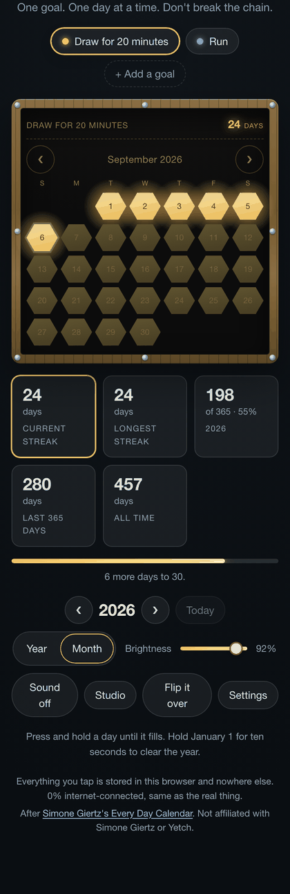

# The Every Day Calendar

A web recreation of [Simone Giertz's Every Day Calendar][kickstarter], rebuilt
in Rust with [Dioxus][dioxus].

Set one goal. Light one day at a time. Don't break the chain.


This is a rewrite of [zmxv/everydaycalendar][original], the original HTML5
edition. It puts back the parts of the hardware, and of the Kickstarter
pitch, that the web version never had.

## What's here that wasn't before

The original web app was a faithful little thing: a 12×31 grid of gold
hexagons, click to toggle, saved to `localStorage`. It left out most of what
makes the object work.

| | Original web app | This |
| --- | --- | --- |
| **The goal** | Never asked | Named, editable, printed on the board's silkscreen |
| **Press and hold** | Instant click toggle | A day only changes after a deliberate hold, and clearing one takes longer than lighting it |
| **Reset** | Click 365 pads | Hold January 1 for ten seconds, exactly like the hardware, with Undo |
| **Brightness** | Not there | A dimmer, like the knob on the back of the real board |
| **Power-on sequence** | Not there | The light sweep the hardware runs at boot |
| **Streaks** | Not there | Current streak, longest streak, trailing year, all-time, and a milestone bar |
| **Today** | Indistinguishable | Ringed and pulsing, and the streak warns you while today is still dark |
| **More than one habit** | Explicitly punted to another app | Up to eight goals, each with its own glow |
| **Phones** | Explicitly punted to another app | Responsive, plus a large-pad month view |
| **Keyboard** | Not there | Full arrow-key navigation, hold on Space or Enter, live region for screen readers |
| **Your data** | `localStorage`, plus Google Analytics | `localStorage`, plus JSON export/import, and no analytics at all |
| **Several devices** | Separate calendars | One shared calendar, via an optional server you run yourself |

On a narrow screen the board switches to a month of large pads, and there's a
dark theme:



Two things from the original are kept on purpose:

- Quick-tap mode. Settings → *Press and hold to change a day* → off restores
  the original instant-toggle behaviour, drag-to-paint included.
- The save format. Each year is still packed into the same 61-character,
  six-bits-per-character string. Saves from `everydaycalendar.app` in this
  browser are picked up automatically the first time you load this app.

## Running it

```sh
rustup target add wasm32-unknown-unknown
cargo install dioxus-cli --version 0.7 --locked

cd web
dx serve --platform web        # http://127.0.0.1:8080
dx build --platform web --release
```

The release build lands in `target/dx/everydaycalendar/release/web/public` and
is a plain static directory. Copy it anywhere that serves files.

```sh
cargo test --workspace         # date maths, the save codec, streaks, the merge
```

## Sharing days between devices

By default nothing leaves the browser, which means your phone and your laptop
keep separate calendars. `edc-sync` is an optional server that joins them into
one calendar without handing anyone else a copy.

```sh
cd web && dx build --platform web --release && cd ..
cargo run --release -p edc-sync -- \
  --dir target/dx/everydaycalendar/release/web/public \
  --data ~/.edc/doc.json
```

It listens on `0.0.0.0:8080` and serves the app and the API from the same
origin, so any device on your network opens
`http://<your-machine>:8080`. Off your network, put
[Tailscale](https://tailscale.com/) on both machines and use the Tailscale
address. No ports opened, nothing exposed to the internet.

The client notices the server on its own: it probes `/api/health` at startup,
and falls back to browser-only storage when nothing answers. The console shows
which mode you're in.

How the merge works: each day is its own last-write-wins register, stamped
with a millisecond timestamp and a per-browser device id. Lighting the 4th on
your phone and the 5th on your laptop keeps both. A whole-year bitset could
not do that. Clearing a day writes `lit: false` rather than deleting the
entry, so a device that was offline during a reset can't resurrect what it
still remembers. Tests in `core/src/model.rs` cover every property here.

Three things worth knowing before you rely on it:

- **There is no authentication.** Anyone who can reach the port can read and
  write your calendar. That is fine on a home network or a Tailscale network,
  and not fine on the open internet.
- **Merges trust device clocks.** A device with a badly wrong clock will win
  or lose conflicts it shouldn't.
- **Settings stay local.** Brightness, theme, sound and year-versus-month
  belong to the screen you're looking at, not to the habit, so they are not
  synced.

## How it's put together

```
core/                a platform-free crate, compiled into both the client and the server
  date.rs            proleptic-Gregorian date maths, no date crate
  bits.rs            the 366-bit year and the original app's 61-character encoding
  model.rs           the synced document: day log, goals, and the merge
  stats.rs           streaks, totals, milestones
  legacy.rs          backup format, import, and migration from older storage
  prefs.rs           device-local settings
web/                 the Dioxus client
  src/main.rs        launch, and the stylesheet asset
  src/platform.rs    the browser edges: clock, randomness, focus, downloads
  src/storage.rs     localStorage, and picking up older saves
  src/sync.rs        talking to the sync server, when there is one
  src/audio.rs       the optional chime, synthesised from oscillators
  src/ui/mod.rs      shared context, the hold/reset/undo rituals, root layout
  src/ui/board.rs    the PCB, the pads, keyboard navigation
  src/ui/console.rs  goals, readout, dimmer, settings, export/import
  src/ui/about.rs    the back of the board
  assets/main.css
server/              axum: merge, persist, serve the client
```

The document lives in one `Signal<Doc>` provided through context; every write
goes to `localStorage` through a single effect, and a background task pushes
it to the server when there is one. Pads take their state as props so a change
re-renders only the pads it touched.

The board is CSS, not images: hexagons are `clip-path` polygons, the bamboo
frame is layered gradients, and pad sizing is driven by container query units
so the whole board scales from a phone to a desktop without a media query.

## Privacy

With no sync server, nothing leaves your browser: no account, no analytics, no
network requests after the page loads. The physical calendar is proudly 0%
internet-connected, and so is this. With one, your days reach exactly the
machine you chose to run it on. **Export backup** in Settings gives you a copy
either way.

## Credit

The Every Day Calendar was designed by [Simone Giertz][yetch] and funded on
[Kickstarter][kickstarter] in 2018. This is an unaffiliated tribute, and it
stands on [Zhen Wang's original web edition][original].

MIT licensed, same as the original.

[kickstarter]: https://www.kickstarter.com/projects/simonegiertz/the-every-day-calendar
[original]: https://github.com/zmxv/everydaycalendar
[dioxus]: https://dioxuslabs.com/
[yetch]: https://yetch.studio/
